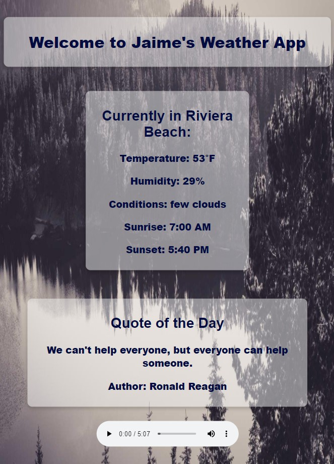

# Jaime's Weather App
A single-page weather application built with React that provides current weather conditions for your location.

## Live Demo
[https://jaimedrodriguezweatherapp.netlify.app/](https://jaimedrodriguezweatherapp.netlify.app/)

## Project Description
This weather application provides users with live weather information based on their current location. The app uses the **Geolocation API** to retrieve the user's coordinates and the **OpenWeatherMap API** to fetch weather data. The user is presented with the current temperature, humidity, weather conditions, sunrise, and sunset times.

The app also features:
- **Dynamic background images** from the Lorem Picsum API that change based on weather conditions
- **Quote of the Day** powered by the DummyJSON Quotes API
- **Music controls** via the React Audio Player

An error message is shown if geolocation is not supported or if weather data cannot be retrieved.

## Tech Stack
- **React 18** with hooks
- **Geolocation API** — retrieves the user's current coordinates
- **OpenWeatherMap API** — fetches weather data by latitude/longitude
- **DummyJSON Quotes API** — delivers a random quote on each visit
- **Lorem Picsum API** — dynamic weather-based background images
- **React Audio Player** — music playback controls
- **Semantic UI React** — UI components
- **Netlify** — hosting and continuous deployment

## Installation

1. Clone the repository:
```
git clone https://github.com/JDRGit/10.4-weather-app.git
```
2. Navigate to the project directory:
```
cd 10.4-weather-app
```
3. Install dependencies:
```
npm install
```
4. Create a `.env` file in the project root and add your OpenWeatherMap API key:
```
REACT_APP_WEATHER_API_KEY=your_api_key_here
```
> Sign up for a free key at [OpenWeatherMap](https://openweathermap.org/api)

5. Start the development server:
```
npm start
```
6. Open [http://localhost:3000](http://localhost:3000) in your browser.

## Netlify Deployment
Environment variables must be set in the Netlify dashboard under **Site Configuration → Environment Variables**:
- `REACT_APP_WEATHER_API_KEY` — your OpenWeatherMap API key

## Usage
Allow the browser to access your location when prompted. The app will display local weather, a background image, a quote of the day, and music controls.

## Screenshots


