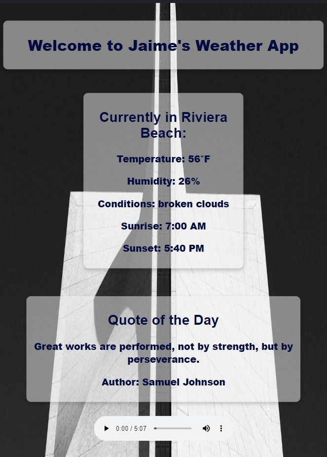

# Jaime's Weather App:
A single-page weather application built using React, that provides the current weather conditions of your location.


## Project Description
This weather application is designed to provide users with live weather information of their current location. The app uses the Geolocation API to retrieve the user's current location and the OpenWeatherMap API to retrieve weather data based on the latitude and longitude obtained from the Geolocation API. The user is presented with current temperature, humidity, weather conditions, sunrise, and sunset time of their location.

Additionally, the app provides a visually appealing user experience by incorporating background images from the Lorem Picsum API and music control features using the React Audio Player dependency. The images change dynamically based on the weather conditions, and users can play, pause, and control the volume of the music with ease.

This project is designed to provide users with a source of inspiration every time they visit the app. The Inspiration API is used to retrieve quotes and present them to the users in the form of a JSON dump of the author and quote. The API uses a cache that expires every hour to ensure that quotes do not get updated during this period.

The application also includes an error message in case the Geolocation API is not supported by the user's browser or if there was an error retrieving the user's location or weather data.

## Installation:


1. Clone the repository to your local machine:
```
git clone https://github.com/<username>/10.4-weather-app.git
```
2. Navigate to the project directory:
```
cd weather-app
```
3. Install the dependencies:
```
npm install
```
- npm install --save react-audio-player

4. Start the development server:
```
npm start
```
5. Open your browser and navigate to http://localhost:3000 to view the app.

## Usage
Once the project is up and running, the user can simply allow browser access your location to retrieve the weather information of their current location. The background image and quote will change dynamically based on the weather conditions. The user can also control the music functions using the React Audio Player.

Note: Before you can use the app, you will need to sign up for a free API key from https://openweathermap.org
## Tech Stack:

This project was built using the following technologies:

- Utilizes the Geolocation API to retrieve the user's current location
- Uses the OpenWeatherMap API to retrieve weather data based on the user's location
- Dynamic background images from Lorem Picsum API https://picsum.photos
- Inspiration API provides motivational quotes to the users
- React Audio Player for music control functions
- Built with JavaScript, HTML, and CSS
- AJAX: Asynchronous JavaScript and XML is used to make API requests and dynamically update the user interface.


## Screenshots

